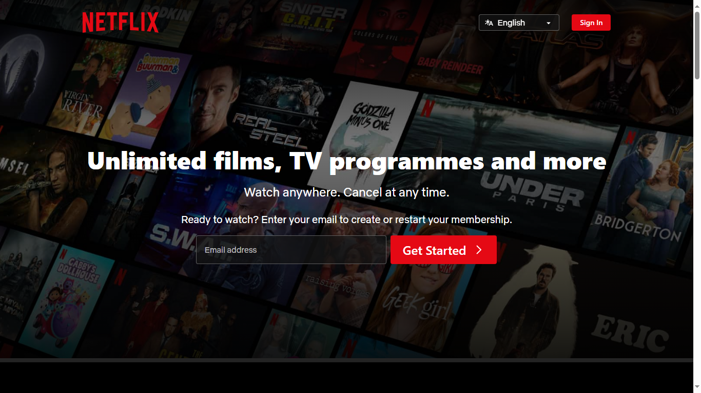

# Netflix Clone 🎥

This project is a clone of the Netflix website, built as a part of learning web development skills.



## Live Demo 🚀

Check out the live demo [here](https://krypto-etox.github.io/Netflix-clone/).

## Features 🌟

- Responsive design, suitable for desktop and mobile browsers.
- Mimics the main functionalities of Netflix, including:
  - Viewing movies and TV shows.
  - Responsive navbar with links.
  - Carousel for featured content.
  - Movie/TV show cards with descriptions.
  - Footer section with additional links.

## Technologies Used 🛠️

- HTML5
- CSS3 (Flexbox, Grid)
- JavaScript

## Usage 📋

To clone and run this application locally, you can follow these steps:

1. Clone the repository:

   ```
   git clone https://github.com/krypto-etox/Netflix-clone.git
   ```

2. Navigate into the project directory:

   ```
   cd Netflix-clone
   ```

3. Open `index.html` in your browser.

## Contributing 🤝

Contributions are welcome! Feel free to submit pull requests or open issues if you find any bugs or want to propose new features.

## License 📄

This project is licensed under the MIT License - see the [LICENSE](LICENSE) file for details.

## Acknowledgments 🙏

- This project was inspired by Netflix.
---
